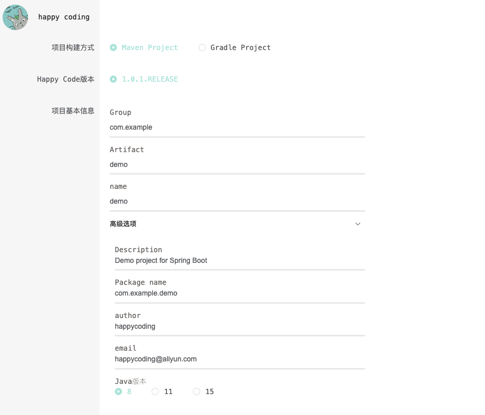
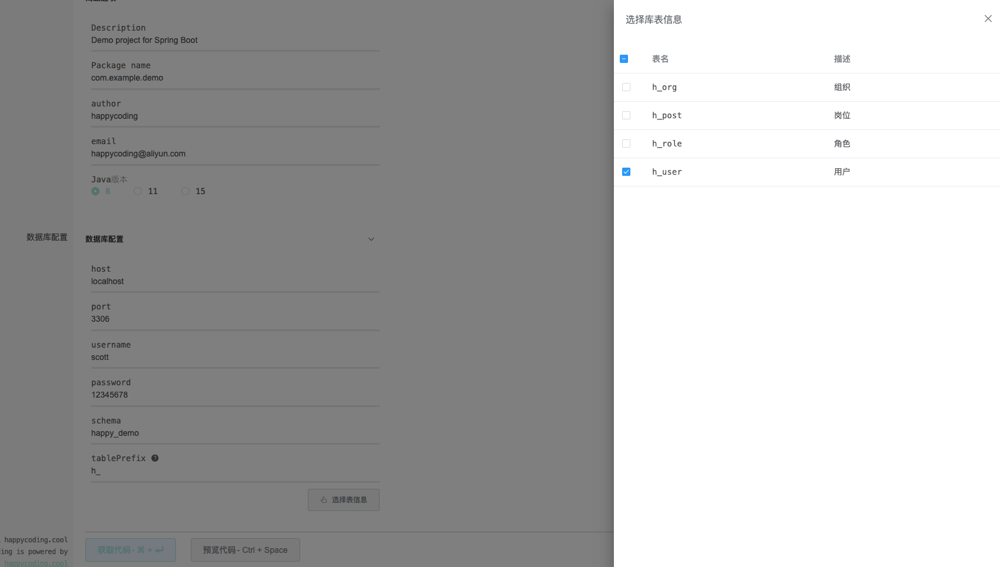
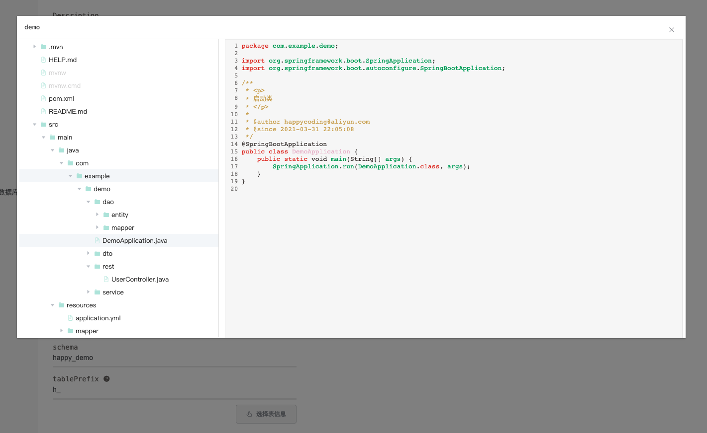

### 脚手架
happy-code 脚手架工具
### 简介
- 该项目为happy-code框架的配套脚手架，为例方便单独部署，采用单体项目架构
- 项目参考了Spring Initializr和Aliyun Java Initializr的实现形式
- 项目引入了mybatis-plus-generator并做了功能扩展，使其更加符合happy code框架所倡导的工程结构

### 项目截图

- 填写生成所需的参数信息 

- 填写数据库连接信息，生成单表操作接口(可选)

- 生成代码预览

### 项目地址
- [happy code 脚手架](http://www.happycoding.cool/bootstrap/)

### 参考连接
- [Spring Initializr](https://start.spring.io/)
- [Aliyun Java Initializr](https://start.aliyun.com/bootstrap.html)
- [mybatis-plus-generator](https://baomidou.com/guide/generator.html)