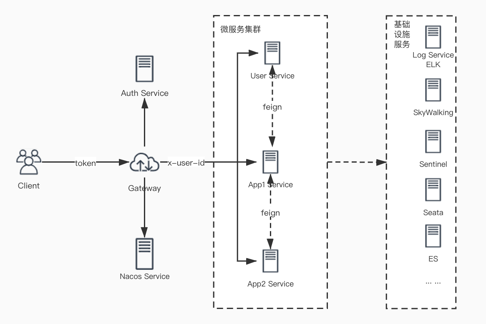

## 平台介绍
Happycoding期望打造一个企业级的技术平台，结合作者多年的开发经验，抽象、封装一批应用标准服务及功能，最大化的实现技术能力的复用，降低微服务架构搭建难度，提升产品研发、项目实施交付的能力！
### 平台规划
平台建设的重点主要围绕以下三个方面：
- 微服务基础开发框架
- 微服务基础设施支撑服务
- 服务监控

### 平台架构
Happycoding微服务平台架构： 

